# Diagrams

Every diagram shown in the notebooks, as Mermaid source (GitHub renders these blocks) with the pre-rendered image below it.
The notebooks embed the same images, so they display offline and without any external script.
Sources: `docs/figures/<name>.mmd`; images: `docs/figures/rendered/<name>.png` (Mermaid 11.6.0 with the ELK layout).

## Schemas and volume in catalog `dbw_wb_outcome`

Notebook: `notebooks/p00_setup.py`

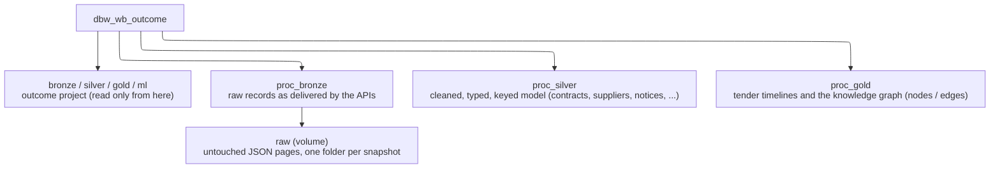
```mermaid
---
config:
  layout: elk
  htmlLabels: false
  flowchart:
    htmlLabels: false
    wrappingWidth: 600
---
flowchart TD
    cat["dbw_wb_outcome"]
    old["bronze / silver / gold / ml<br/>outcome project (read only from here)"]
    pb["proc_bronze<br/>raw records as delivered by the APIs"]
    raw["raw (volume)<br/>untouched JSON pages, one folder per snapshot"]
    ps["proc_silver<br/>cleaned, typed, keyed model (contracts, suppliers, notices, ...)"]
    pg["proc_gold<br/>tender timelines and the knowledge graph (nodes / edges)"]
    cat --> old
    cat --> pb --> raw
    cat --> ps
    cat --> pg
```

## Silver model: core contract model

Notebook: `notebooks/p03_silver_model.py`

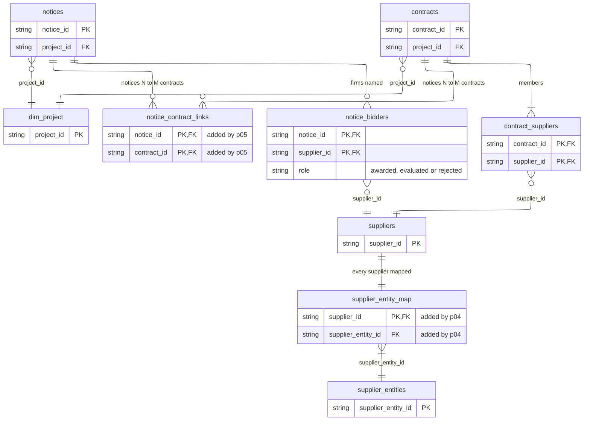
```mermaid
---
config:
  layout: elk
---
erDiagram
    dim_project {
        string project_id PK
    }
    notices {
        string notice_id PK
        string project_id FK
    }
    contracts {
        string contract_id PK
        string project_id FK
    }
    notice_contract_links {
        string notice_id PK, FK "added by p05"
        string contract_id PK, FK "added by p05"
    }
    notice_bidders {
        string notice_id PK, FK
        string supplier_id PK, FK
        string role "awarded, evaluated or rejected"
    }
    contract_suppliers {
        string contract_id PK, FK
        string supplier_id PK, FK
    }
    suppliers {
        string supplier_id PK
    }
    supplier_entity_map {
        string supplier_id PK, FK "added by p04"
        string supplier_entity_id FK "added by p04"
    }
    supplier_entities {
        string supplier_entity_id PK
    }
    notices }o--|| dim_project : "project_id"
    contracts }o--|| dim_project : "project_id"
    notices ||--o{ notice_contract_links : "notices N to M contracts"
    contracts ||--o{ notice_contract_links : "notices N to M contracts"
    notices ||--o{ notice_bidders : "firms named"
    contracts ||--|{ contract_suppliers : "members"
    notice_bidders }o--|| suppliers : "supplier_id"
    contract_suppliers }o--|| suppliers : "supplier_id"
    suppliers ||--|| supplier_entity_map : "every supplier mapped"
    supplier_entity_map }|--|| supplier_entities : "supplier_entity_id"
```

## Silver model: lookups (dimension tables and the FKs that point to them)

Notebook: `notebooks/p03_silver_model.py`

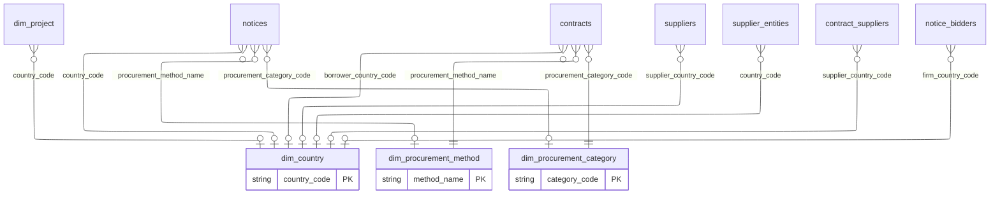
```mermaid
---
config:
  layout: elk
---
erDiagram
    dim_country {
        string country_code PK
    }
    dim_procurement_method {
        string method_name PK
    }
    dim_procurement_category {
        string category_code PK
    }
    dim_project }o--o| dim_country : "country_code"
    notices }o--o| dim_country : "country_code"
    contracts }o--o| dim_country : "borrower_country_code"
    suppliers }o--o| dim_country : "supplier_country_code"
    supplier_entities }o--o| dim_country : "country_code"
    contract_suppliers }o--o| dim_country : "supplier_country_code"
    notice_bidders }o--o| dim_country : "firm_country_code"
    contracts }o--|| dim_procurement_method : "procurement_method_name"
    notices }o--o| dim_procurement_method : "procurement_method_name"
    contracts }o--|| dim_procurement_category : "procurement_category_code"
    notices }o--o| dim_procurement_category : "procurement_category_code"
```

## Supplier entity resolution steps

Notebook: `notebooks/p04_supplier_resolution.py`

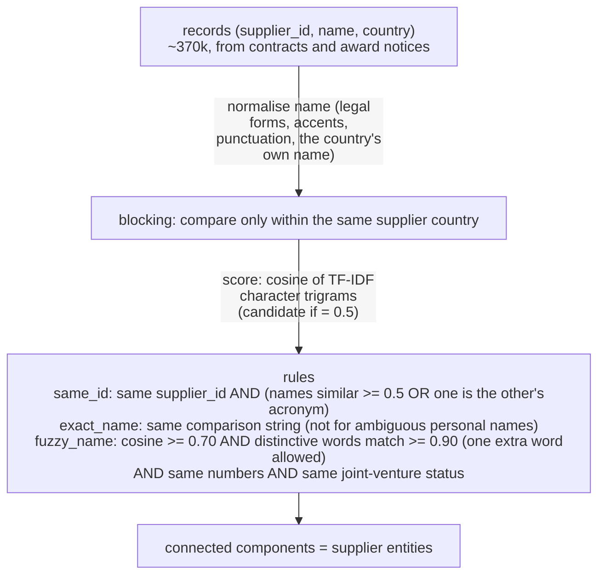
```mermaid
---
config:
  layout: elk
  htmlLabels: false
  flowchart:
    htmlLabels: false
    wrappingWidth: 600
---
flowchart TD
    rec["records (supplier_id, name, country)<br/>~370k, from contracts and award notices"]
    blk["blocking: compare only within the same supplier country"]
    rules["rules<br/>same_id: same supplier_id AND (names similar >= 0.5 OR one is the other's acronym)<br/>exact_name: same comparison string (not for ambiguous personal names)<br/>fuzzy_name: cosine >= 0.70 AND distinctive words match >= 0.90 (one extra word allowed)<br/>AND same numbers AND same joint-venture status"]
    cc["connected components = supplier entities"]
    rec -->|"normalise name (legal forms, accents, punctuation, the country's own name)"| blk
    blk -->|"score: cosine of TF-IDF character trigrams (candidate if >= 0.5)"| rules
    rules --> cc
```

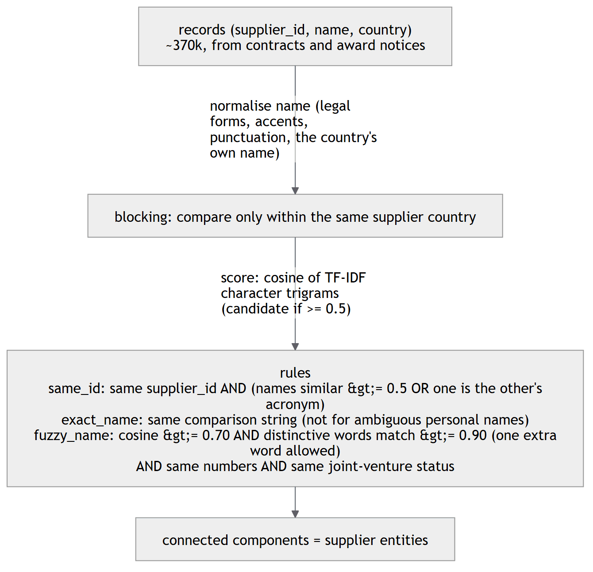

## Tender timeline: notice to signed contract

Notebook: `notebooks/p05_link_notices_awards.py`

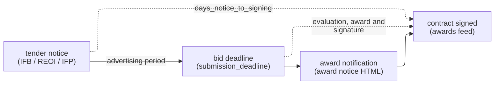
```mermaid
---
config:
  layout: elk
  htmlLabels: false
  flowchart:
    htmlLabels: false
    wrappingWidth: 600
---
flowchart LR
    tn["tender notice<br/>(IFB / REOI / IFP)"]
    bd["bid deadline<br/>(submission_deadline)"]
    an["award notification<br/>(award notice HTML)"]
    cs["contract signed<br/>(awards feed)"]
    tn -->|"advertising period"| bd
    bd --> an --> cs
    bd -.->|"evaluation, award and signature"| cs
    tn -.->|"days_notice_to_signing"| cs
```

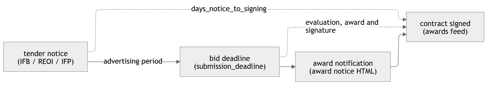

## Knowledge graph: node and edge types

Notebook: `notebooks/p06_knowledge_graph.py`

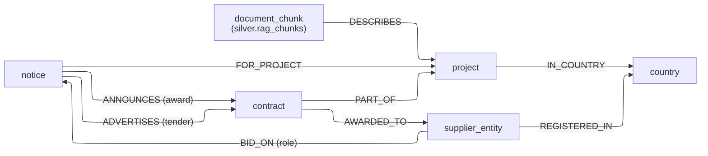
```mermaid
---
config:
  layout: elk
  htmlLabels: false
  flowchart:
    htmlLabels: false
    wrappingWidth: 600
---
flowchart LR
    document_chunk["document_chunk<br/>(silver.rag_chunks)"]
    project["project"]
    country["country"]
    notice["notice"]
    contract["contract"]
    supplier_entity["supplier_entity"]
    project -->|"IN_COUNTRY"| country
    supplier_entity -->|"REGISTERED_IN"| country
    notice -->|"FOR_PROJECT"| project
    document_chunk -->|"DESCRIBES"| project
    notice -->|"ADVERTISES (tender)"| contract
    notice -->|"ANNOUNCES (award)"| contract
    contract -->|"AWARDED_TO"| supplier_entity
    contract -->|"PART_OF"| project
    supplier_entity -->|"BID_ON (role)"| notice
```

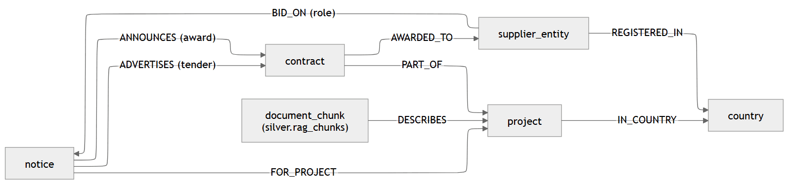

## Tender duration and risk model pipeline

Notebook: `notebooks/p07_tender_risk_model.py`

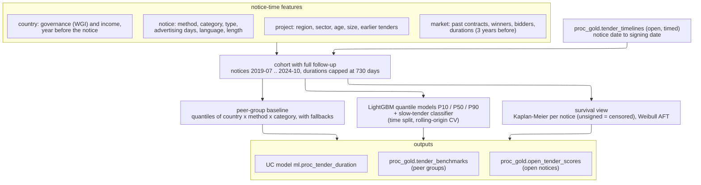
```mermaid
---
config:
  layout: elk
  htmlLabels: false
  flowchart:
    htmlLabels: false
    wrappingWidth: 600
---
flowchart TD
    tt["proc_gold.tender_timelines (open, timed)<br/>notice date to signing date"]
    subgraph feats["notice-time features"]
        f1["notice: method, category, type,<br/>advertising days, language, length"]
        f2["project: region, sector, age, size, earlier tenders"]
        f3["country: governance (WGI) and income,<br/>year before the notice"]
        f4["market: past contracts, winners, bidders,<br/>durations (3 years before)"]
    end
    cohort["cohort with full follow-up<br/>notices 2019-07 .. 2024-10, durations capped at 730 days"]
    base["peer-group baseline<br/>quantiles of country x method x category, with fallbacks"]
    lgbm["LightGBM quantile models P10 / P50 / P90<br/>+ slow-tender classifier<br/>(time split, rolling-origin CV)"]
    surv["survival view<br/>Kaplan-Meier per notice (unsigned = censored), Weibull AFT"]
    subgraph outs["outputs"]
        o1["proc_gold.tender_benchmarks<br/>(peer groups)"]
        o2["proc_gold.open_tender_scores<br/>(open notices)"]
        o3["UC model ml.proc_tender_duration"]
    end
    tt --> cohort
    feats --> cohort
    cohort --> base
    cohort --> lgbm
    cohort --> surv
    base --> outs
    lgbm --> outs
    surv --> outs
```

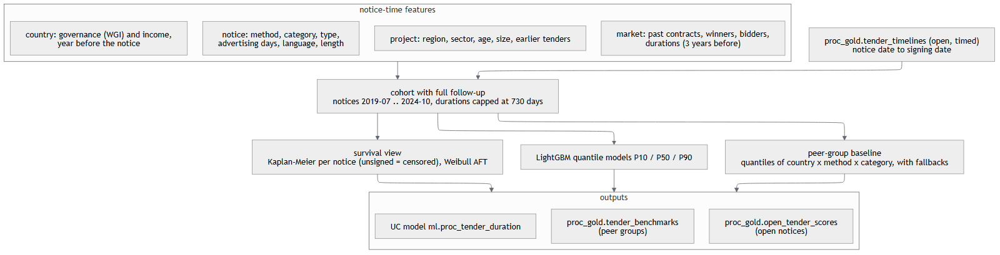

## Procurement assistant: guard, planner, tools, writer, validation

Notebook: `notebooks/p08_procurement_agent.py`

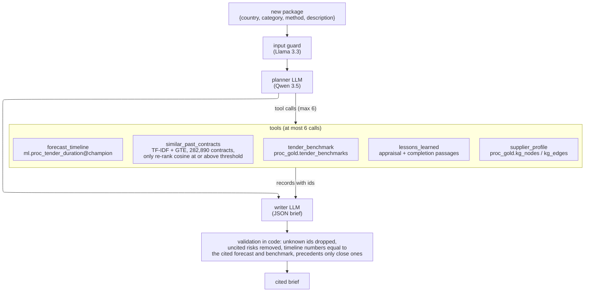
```mermaid
---
config:
  layout: elk
  htmlLabels: false
  flowchart:
    htmlLabels: false
    wrappingWidth: 600
---
flowchart TD
    pkg["new package<br/>{country, category, method, description}"]
    guard["input guard<br/>(Llama 3.3)"]
    planner["planner LLM<br/>(Qwen 3.5)"]
    subgraph tools["tools (at most 6 calls)"]
        t1["similar_past_contracts<br/>TF-IDF + GTE, 282,890 contracts,<br/>only re-rank cosine at or above threshold"]
        t2["tender_benchmark<br/>proc_gold.tender_benchmarks"]
        t3["forecast_timeline<br/>ml.proc_tender_duration@champion"]
        t4["lessons_learned<br/>appraisal + completion passages"]
        t5["supplier_profile<br/>proc_gold.kg_nodes / kg_edges"]
    end
    writer["writer LLM<br/>(JSON brief)"]
    validate["validation in code: unknown ids dropped,<br/>uncited risks removed, timeline numbers equal to<br/>the cited forecast and benchmark, precedents only close ones"]
    brief["cited brief"]
    pkg --> guard --> planner
    planner -->|"tool calls (max 6)"| tools
    tools -->|"records with ids"| writer
    planner --> writer
    writer --> validate --> brief
```

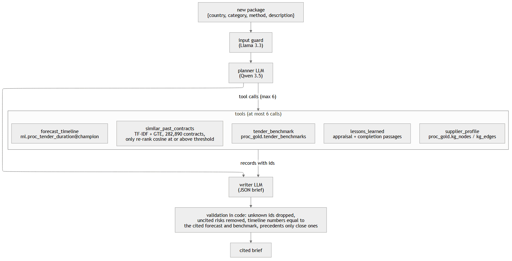

## Evidence over a project's life (which source speaks when)

Notebook: `notebooks/p09_conflicting_evidence.py`

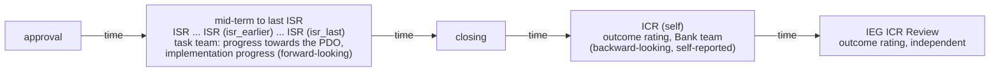
```mermaid
---
config:
  layout: elk
  htmlLabels: false
  flowchart:
    htmlLabels: false
    wrappingWidth: 600
---
flowchart LR
    ap["approval"]
    isr["mid-term to last ISR<br/>ISR ... ISR (isr_earlier) ... ISR (isr_last)<br/>task team: progress towards the PDO,<br/>implementation progress (forward-looking)"]
    cl["closing"]
    icr["ICR (self)<br/>outcome rating, Bank team<br/>(backward-looking, self-reported)"]
    ieg["IEG ICR Review<br/>outcome rating, independent"]
    ap -->|"time"| isr -->|"time"| cl -->|"time"| icr -->|"time"| ieg
```

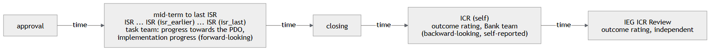

## Continuous learning loop

Notebook: `notebooks/p10_continuous_learning.py`

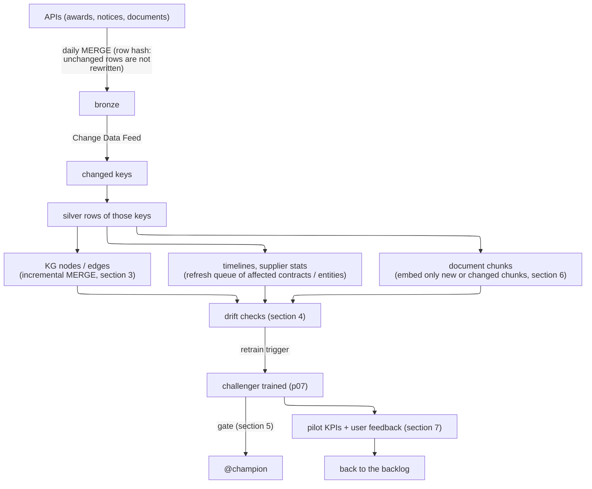
```mermaid
---
config:
  layout: elk
  htmlLabels: false
  flowchart:
    htmlLabels: false
    wrappingWidth: 600
---
flowchart TD
    apis["APIs (awards, notices, documents)"]
    bronze["bronze"]
    keys["changed keys"]
    silver["silver rows of those keys"]
    kg["KG nodes / edges<br/>(incremental MERGE, section 3)"]
    stats["timelines, supplier stats<br/>(refresh queue of affected contracts / entities)"]
    chunks["document chunks<br/>(embed only new or changed chunks, section 6)"]
    drift["drift checks (section 4)"]
    chall["challenger trained (p07)"]
    champ["@champion"]
    kpis["pilot KPIs + user feedback (section 7)"]
    backlog["back to the backlog"]
    apis -->|"daily MERGE (row hash: unchanged rows are not rewritten)"| bronze
    bronze -->|"Change Data Feed"| keys --> silver
    silver --> kg
    silver --> stats
    silver --> chunks
    kg --> drift
    stats --> drift
    chunks --> drift
    drift -->|"retrain trigger"| chall
    chall -->|"gate (section 5)"| champ
    chall --> kpis --> backlog
```

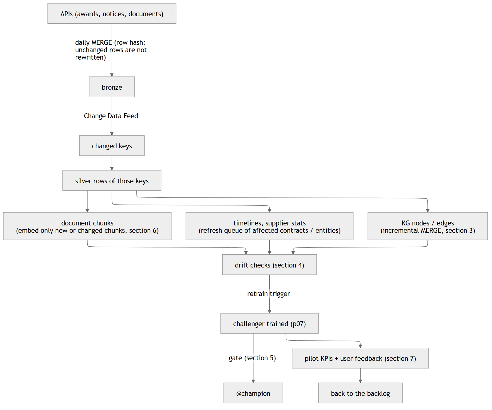

## Backtest design

Notebook: `notebooks/p11_backtest.py`

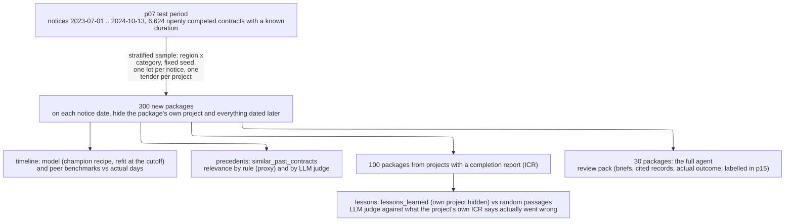
```mermaid
---
config:
  layout: elk
  htmlLabels: false
  flowchart:
    htmlLabels: false
    wrappingWidth: 600
---
flowchart TD
    test["p07 test period<br/>notices 2023-07-01 .. 2024-10-13, 6,624 openly competed contracts with a known duration"]
    pk["300 new packages<br/>on each notice date, hide the package's own project and everything dated later"]
    tl["timeline: model (champion recipe, refit at the cutoff)<br/>and peer benchmarks vs actual days"]
    pr["precedents: similar_past_contracts<br/>relevance by rule (proxy) and by LLM judge"]
    icr["100 packages from projects with a completion report (ICR)"]
    ls["lessons: lessons_learned (own project hidden) vs random passages<br/>LLM judge against what the project's own ICR says actually went wrong"]
    full["30 packages: the full agent<br/>review pack (briefs, cited records, actual outcome; labelled in p15)"]
    test -->|"stratified sample: region x category, fixed seed,<br/>one lot per notice, one tender per project"| pk
    pk --> tl
    pk --> pr
    pk --> icr --> ls
    pk --> full
```

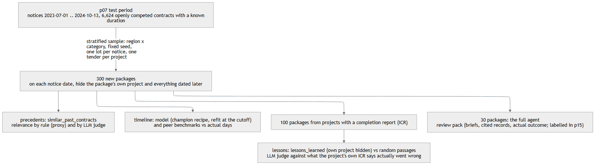

## Structure-aware document parsing

Notebook: `notebooks/p12_document_parsing.py`

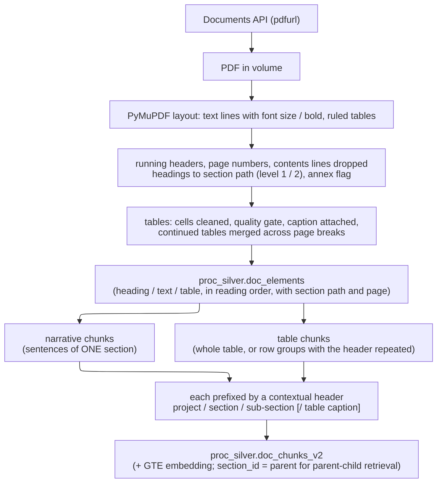
```mermaid
---
config:
  layout: elk
  htmlLabels: false
  flowchart:
    htmlLabels: false
    wrappingWidth: 600
---
flowchart TD
    api["Documents API (pdfurl)"]
    pdf["PDF in volume"]
    lay["PyMuPDF layout: text lines with font size / bold, ruled tables"]
    hd["running headers, page numbers, contents lines dropped<br/>headings to section path (level 1 / 2), annex flag"]
    tb["tables: cells cleaned, quality gate, caption attached,<br/>continued tables merged across page breaks"]
    el["proc_silver.doc_elements<br/>(heading / text / table, in reading order, with section path and page)"]
    nc["narrative chunks<br/>(sentences of ONE section)"]
    tc["table chunks<br/>(whole table, or row groups with the header repeated)"]
    hdr["each prefixed by a contextual header<br/>project / section / sub-section [/ table caption]"]
    out["proc_silver.doc_chunks_v2<br/>(+ GTE embedding; section_id = parent for parent-child retrieval)"]
    api --> pdf --> lay --> hd --> tb --> el
    el --> nc --> hdr
    el --> tc --> hdr
    hdr --> out
```

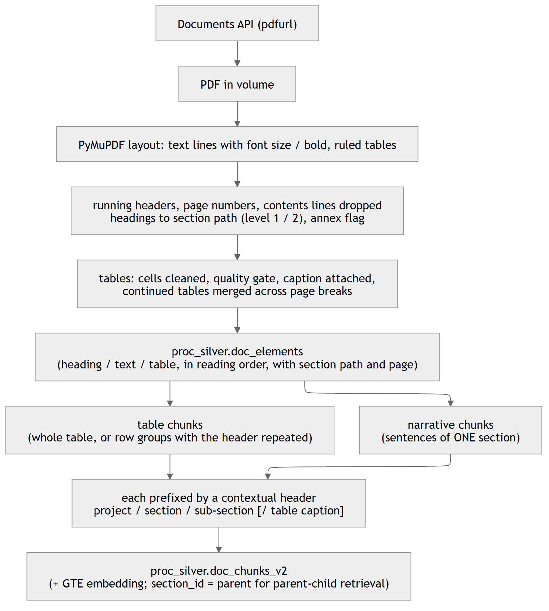

## Tender design checks

Notebook: `notebooks/p13_tender_design_checks.py`

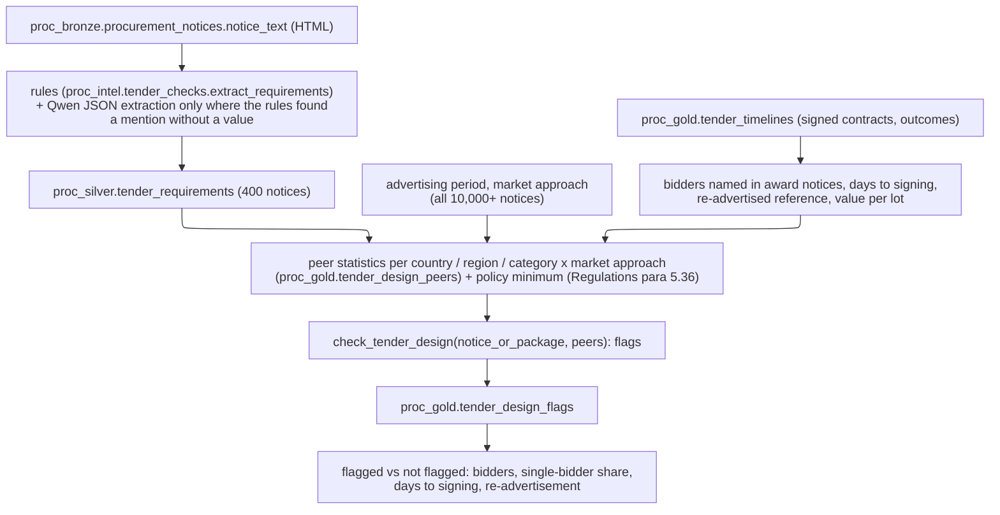
```mermaid
---
config:
  layout: elk
  htmlLabels: false
  flowchart:
    htmlLabels: false
    wrappingWidth: 600
---
flowchart TD
    html["proc_bronze.procurement_notices.notice_text (HTML)"]
    rules["rules (proc_intel.tender_checks.extract_requirements)<br/>+ Qwen JSON extraction only where the rules found<br/>a mention without a value"]
    req["proc_silver.tender_requirements (400 notices)"]
    adv["advertising period, market approach<br/>(all 10,000+ notices)"]
    tt["proc_gold.tender_timelines (signed contracts, outcomes)"]
    outc["bidders named in award notices, days to signing,<br/>re-advertised reference, value per lot"]
    peers["peer statistics per country / region / category x market approach<br/>(proc_gold.tender_design_peers) + policy minimum (Regulations para 5.36)"]
    chk["check_tender_design(notice_or_package, peers): flags"]
    flags["proc_gold.tender_design_flags"]
    ev["flagged vs not flagged: bidders, single-bidder share,<br/>days to signing, re-advertisement"]
    html --> rules --> req --> peers
    adv --> peers
    tt --> outc --> peers
    peers --> chk --> flags --> ev
```

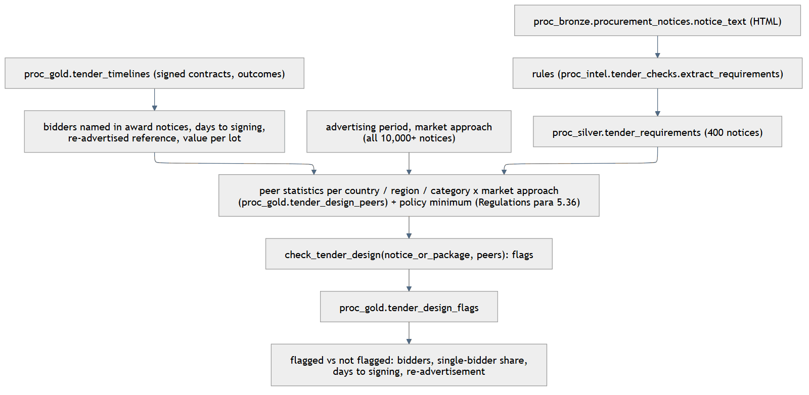

## Execution monitoring and early warnings

Notebook: `notebooks/p14_execution_monitoring.py`

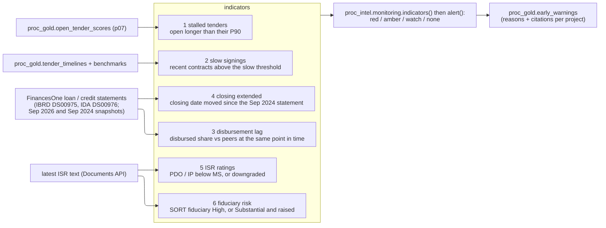
```mermaid
---
config:
  layout: elk
  htmlLabels: false
  flowchart:
    htmlLabels: false
    wrappingWidth: 600
---
flowchart LR
    s1["proc_gold.open_tender_scores (p07)"]
    s2["proc_gold.tender_timelines + benchmarks"]
    s3["FinancesOne loan / credit statements<br/>(IBRD DS00975, IDA DS00976;<br/>Sep 2026 and Sep 2024 snapshots)"]
    s5["latest ISR text (Documents API)"]
    subgraph ind["indicators"]
        i1["1 stalled tenders<br/>open longer than their P90"]
        i2["2 slow signings<br/>recent contracts above the slow threshold"]
        i3["3 disbursement lag<br/>disbursed share vs peers at the same point in time"]
        i4["4 closing extended<br/>closing date moved since the Sep 2024 statement"]
        i5["5 ISR ratings<br/>PDO / IP below MS, or downgraded"]
        i6["6 fiduciary risk<br/>SORT fiduciary High, or Substantial and raised"]
    end
    alert["proc_intel.monitoring.indicators() then alert():<br/>red / amber / watch / none"]
    ew["proc_gold.early_warnings<br/>(reasons + citations per project)"]
    s1 --> i1
    s2 --> i2
    s3 --> i3
    s3 --> i4
    s5 --> i5
    s5 --> i6
    ind --> alert --> ew
```

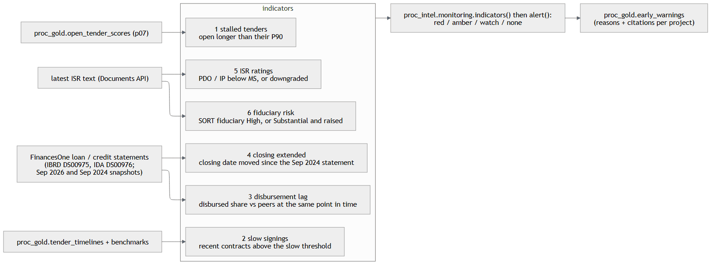

## Evaluation labels: three-tier escalation

Notebook: `notebooks/p15_label_panel.py`

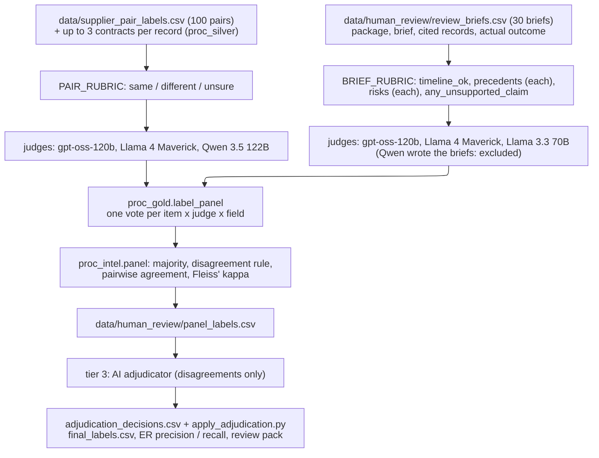
```mermaid
---
config:
  layout: elk
  htmlLabels: false
  flowchart:
    htmlLabels: false
    wrappingWidth: 600
---
flowchart TD
    pairs["data/supplier_pair_labels.csv (100 pairs)<br/>+ up to 3 contracts per record (proc_silver)"]
    prub["PAIR_RUBRIC: same / different / unsure"]
    pj["judges: gpt-oss-120b, Llama 4 Maverick, Qwen 3.5 122B"]
    briefs["data/human_review/review_briefs.csv (30 briefs)<br/>package, brief, cited records, actual outcome"]
    brub["BRIEF_RUBRIC: timeline_ok, precedents (each),<br/>risks (each), any_unsupported_claim"]
    bj["judges: gpt-oss-120b, Llama 4 Maverick, Llama 3.3 70B<br/>(Qwen wrote the briefs: excluded)"]
    panel["proc_gold.label_panel<br/>one vote per item x judge x field"]
    agg["proc_intel.panel: majority, disagreement rule,<br/>pairwise agreement, Fleiss' kappa"]
    pl["data/human_review/panel_labels.csv"]
    adj["tier 3: AI adjudicator (disagreements only)"]
    fin["adjudication_decisions.csv + apply_adjudication.py<br/>final_labels.csv, ER precision / recall, review pack"]
    pairs --> prub --> pj --> panel
    briefs --> brub --> bj --> panel
    panel --> agg --> pl --> adj --> fin
```

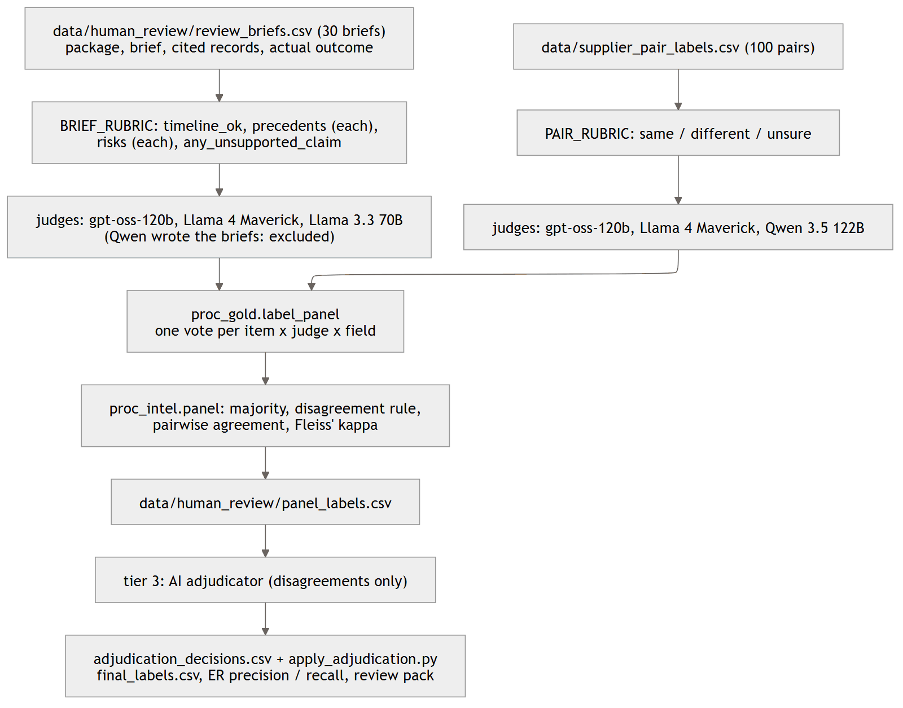

## Agent loop in proc_rag_core

Notebook: `notebooks/proc_rag_core.py`

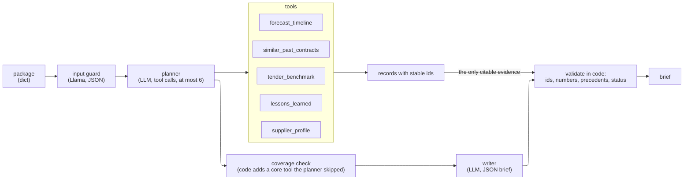
```mermaid
---
config:
  layout: elk
  htmlLabels: false
  flowchart:
    htmlLabels: false
    wrappingWidth: 600
---
flowchart LR
    pkg["package<br/>(dict)"]
    guard["input guard<br/>(Llama, JSON)"]
    planner["planner<br/>(LLM, tool calls, at most 6)"]
    subgraph tools["tools"]
        t1["similar_past_contracts"]
        t2["tender_benchmark"]
        t3["forecast_timeline"]
        t4["lessons_learned"]
        t5["supplier_profile"]
    end
    rec["records with stable ids"]
    cov["coverage check<br/>(code adds a core tool the planner skipped)"]
    writer["writer<br/>(LLM, JSON brief)"]
    val["validate in code:<br/>ids, numbers, precedents, status"]
    brief["brief"]
    pkg --> guard --> planner --> cov --> writer --> val --> brief
    planner --> tools --> rec
    rec -->|"the only citable evidence"| val
```

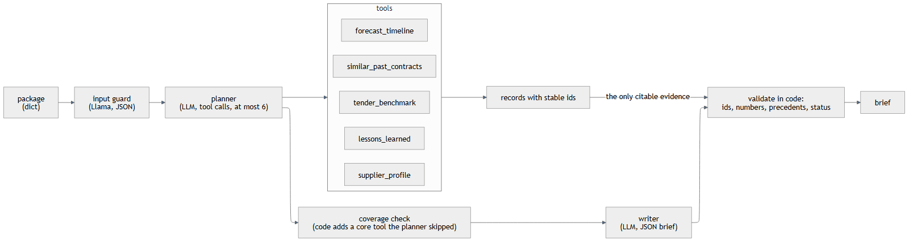
